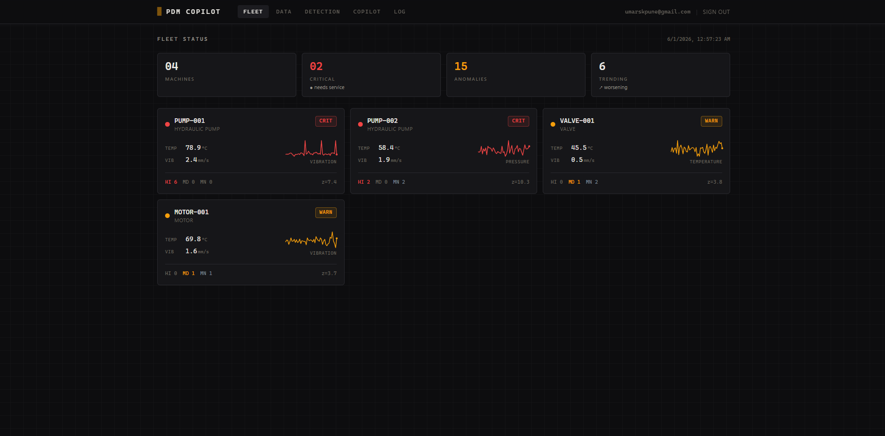
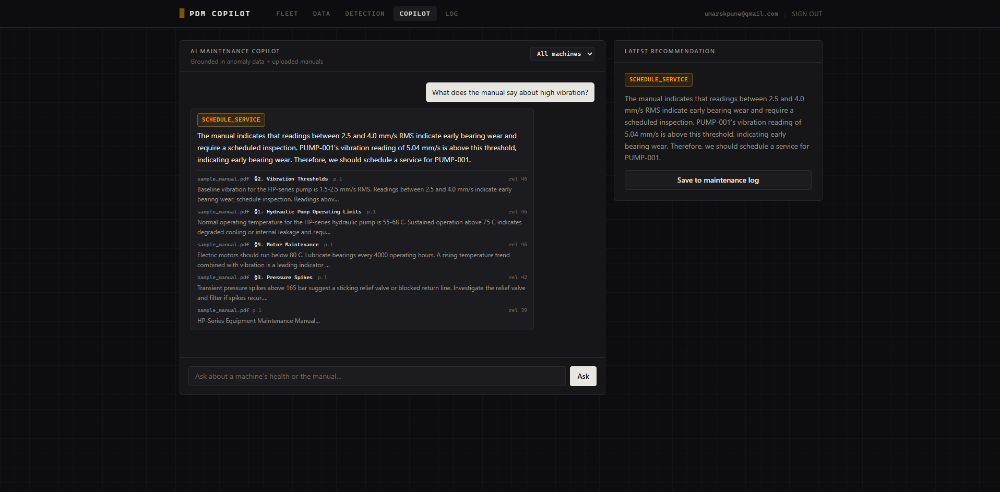

# Predictive Maintenance Copilot

[](https://github.com/umar7shaikh/predictive-maintenance-copilot/actions/workflows/ci.yml)

An AI-powered predictive maintenance platform for industrial equipment (hydraulic
pumps, motors, valves, fluid conveyance). Engineers upload sensor data and equipment
manuals; the system detects anomalies, reasons over them with an LLM grounded in the
manuals, and delivers structured maintenance recommendations in plain English.

> Built and runs **natively on Windows** (no Docker/WSL required). The architecture
> maps cleanly onto Azure for production — see [`docs/architecture.md`](docs/architecture.md).

## Screenshots

**Fleet dashboard** — fleet health at a glance, color-coded by severity with live
readouts and trend sparklines per machine.



**AI Copilot** — grounded, cited maintenance recommendations from the equipment manuals.



## Features

1. **Sensor data analysis** — upload a CSV of time-series readings (temperature,
   pressure, vibration, RPM) across machines. Statistical z-score anomaly detection per
   machine/parameter, severity scoring (HIGH / MEDIUM / MONITOR), trend detection, and
   time-series charts with anomalies highlighted.
2. **Maintenance manual intelligence (RAG)** — upload PDF manuals; they're chunked,
   embedded (MiniLM via ONNX) into ChromaDB, and retrieved to ground AI answers.
3. **AI recommendation engine** — combines the anomaly summary + retrieved manual
   context + your question into a structured verdict (URGENT SERVICE / SCHEDULE SERVICE
   / MONITOR / SAFE) with explanation and citations. Follow-up chat with memory.
4. **ETL pipeline** — Extract → Transform (null handling, unit normalization, rolling
   averages, rate-of-change) → Load to PostgreSQL. Behind a swappable engine interface.
5. **MLflow tracking** — every detection run logs params (z-threshold, window) and
   metrics (anomalies, machines flagged) for an auditable MLOps layer.
6. **Fleet dashboard** — all machines color-coded by health, sorted by severity, with
   drilldown into per-machine charts and anomaly tables.
7. **Maintenance log** — every recommendation is saved with a timestamp and can be
   marked actioned with notes (compliance / warranty audit trail).
8. **Power BI export** — clean CSVs formatted for Power BI ingestion; data model in
   [`docs/powerbi.md`](docs/powerbi.md).
9. **Carbon & energy (Phase 6)** — turns energy use into a traceable CO₂ inventory:
   Scope 1 (diesel gensets) + Scope 2 (grid electricity) from utility bills / fuel logs,
   versioned regional emission factors, and an energy-waste → CO₂ → cost estimate that links
   each anomaly to money and carbon. Foundation for the regulatory report generator
   (CBAM, BRSR, ISSB, SA carbon tax) — see [`docs/product-vision.md`](docs/product-vision.md),
   [`docs/esg.md`](docs/esg.md), and [`docs/competitive-landscape.md`](docs/competitive-landscape.md).

## Tech stack

| Layer | Technology |
|---|---|
| API | FastAPI, JWT auth (passlib + python-jose) |
| DB | PostgreSQL (SQLAlchemy + Alembic) |
| ETL / detection | pandas, numpy, scipy (PySpark-swappable interface) |
| MLOps | MLflow (local file store) |
| RAG | ChromaDB + all-MiniLM-L6-v2 (ONNX) |
| LLM | Groq (Llama 3.1) with a deterministic stub fallback |
| Frontend | React + Vite + Tailwind + Recharts (i18n: EN/HI/MS/TH) |
| Async (later) | FastAPI BackgroundTasks now; Celery + Redis/Memurai in Phase 4 |
| Ingestion gateway | **Go** (stdlib) — high-concurrency telemetry front door (`gateway/`) |
| Edge agent | **Rust** — on-floor agent with offline buffering + sync (`edge-agent/`) |
| Carbon / ESG | Scope 1/2 engine, regulatory reports (ISSB/CBAM/BRSR), hash-chained audit ledger |

## Prerequisites (Windows)

- Python 3.11 (`py -3.11`)
- Node 20+
- PostgreSQL (this project was set up against PostgreSQL 18 on **port 5433**)

## Run with Docker (any OS)

The whole stack — Postgres, Redis, the API, a Celery worker, the MLflow server, and the
frontend — is defined in `docker-compose.yml`. From the project root:

```bash
# optional: export GROQ_API_KEY=...   (otherwise it runs in stub mode)
docker compose up --build
```

Then open http://localhost:5173 (API at :8000, MLflow at :5000). Stop with
`docker compose down` (add `-v` to also drop the data volumes).

The sections below cover the native-Windows setup used during development.

## Setup

### 1. Database
Create the database (using the bundled psql, adjust path/port if needed):

```powershell
& "C:\Program Files\PostgreSQL\18\bin\createdb.exe" -U postgres -p 5433 pdm_copilot
```

### 2. Backend

```powershell
cd backend
py -3.11 -m venv .venv
.\.venv\Scripts\python.exe -m pip install -r requirements.txt
copy .env.example .env   # then edit DATABASE_URL password + GROQ_API_KEY
.\.venv\Scripts\python.exe scripts\gen_sample_data.py   # sample CSV + manual
.\.venv\Scripts\python.exe -m uvicorn app.main:app --reload --port 8000
```

API docs at http://localhost:8000/docs

### 3. Frontend

```powershell
cd frontend
npm install
npm run dev
```

App at http://localhost:5173

## Run / stop (all services)

**One command** (recommended) — from the project root, double-click `start_all.bat`
or run:

```powershell
.\start_all.ps1            # backend + frontend + mlflow (each in its own window)
.\start_all.ps1 -Celery    # also start the Celery worker
.\stop_all.ps1             # stop them all (leaves Postgres + Redis running)
```

Or start each one manually in its own terminal (backend first):

| Service | Start (from the folder shown) | Stop |
|---|---|---|
| **Backend** (`backend/`) | `.\.venv\Scripts\python.exe -m uvicorn app.main:app --port 8000` | Ctrl+C |
| **Frontend** (`frontend/`) | `npm run dev` | Ctrl+C |
| **MLflow server** (`backend/`) | `.\scripts\start_mlflow.ps1` → http://localhost:5000 | Ctrl+C |
| **Celery worker** (`backend/`, optional) | `.\scripts\start_worker.ps1` | Ctrl+C |

Force-stop by port (PowerShell), e.g. the backend:

```powershell
Get-NetTCPConnection -State Listen -LocalPort 8000 | ForEach-Object { Stop-Process -Id $_.OwningProcess -Force }
```

(Ports: backend 8000, frontend 5173, MLflow 5000, Redis 6379, Postgres 5433.)

## Phase 4 — async jobs + distributed ETL (optional)

Two operations in the platform are slow: processing an uploaded sensor CSV (ETL +
anomaly detection) and embedding a PDF manual. By default these run in-process via
FastAPI BackgroundTasks, which is fine for a single user on modest files. Celery and
Spark exist to handle the same work as the system grows.

### Celery + Redis — running heavy jobs outside the web server

By default, processing happens inside the API process. If many large files are uploaded
at once, that work competes with live requests and is lost if the server restarts.

With Celery enabled, the API instead places a job on a **Redis** queue and returns
immediately; separate **worker** processes (which can run on other machines) pick jobs
off the queue and do the work. This keeps the API responsive, lets processing scale by
adding workers, and makes jobs durable — a job survives a worker restart and can retry
on failure.

Enable it: set `USE_CELERY=true` in `.env`, start the worker (`scripts\start_worker.ps1`),
and uploads are handled by the worker instead of BackgroundTasks. Requires Redis on `:6379`.

### PySpark — processing data too large for one machine

pandas loads the whole dataset into one machine's memory, which is ideal up to a few GB.
A real fleet (hundreds of machines sampling continuously) can produce datasets far larger
than that. Spark splits the data across partitions and runs the **same** transforms —
rolling averages, rate-of-change, z-scores — in parallel, so it can process data that
would not fit in memory.

`SparkETLEngine` implements the same `ETLEngine` interface as the pandas engine, so
switching is a config change with no logic rewrite, and it produces identical results
(verified: 960 rows → 15 anomalies, same severities).

Enable it: set `ETL_ENGINE=spark` in `.env` (with `JAVA_HOME` + `HADOOP_HOME` pointing at
a JDK and a winutils folder). Default stays `pandas`.

### Local vs. production

These are optional locally because the demo dataset is small; they are how the same
design scales in production. This maps directly to the Azure target in
[`docs/architecture.md`](docs/architecture.md): BackgroundTasks → Azure Functions,
Redis → Azure Cache for Redis, pandas → Spark on Azure Databricks.

| Concern | Local / demo (default) | Production |
|---|---|---|
| Heavy jobs | FastAPI BackgroundTasks | Celery workers |
| Job queue | — | Redis / Azure Cache for Redis |
| ETL engine | pandas | Spark on Azure Databricks |

## Demo flow

1. Register an account → sign in.
2. **Upload Data** → upload `backend/sample_data/sample_sensors.csv` and
   `sample_data/sample_manual.pdf`.
3. **Fleet** → PUMP-001 shows critical (overheating + vibration trend).
4. Click PUMP-001 → see charts with anomalies highlighted.
5. **AI Copilot** → ask "Is PUMP-001 safe to keep running?" → get a cited verdict.
6. Save it → **Maintenance Log** → mark actioned with a note.
7. Export Power BI CSVs from `/api/export/sensors.csv` and `/api/export/anomalies.csv`.
8. **Carbon** → seed sample energy data with
   `python scripts\seed_carbon.py` (after `reset_and_seed.py`), then open the **Carbon** tab:
   Scope 1/2 totals, avoidable energy waste per machine, and `/api/export/sustainability.csv`.

## Configuration notes

- **No Groq key?** Set `LLM_STUB_MODE=true` (or leave `GROQ_API_KEY` blank) — the app
  returns deterministic severity-based verdicts so the demo still works.
- **RAG model download** — first PDF upload downloads the MiniLM ONNX model (~80MB).
- Phase 4 (Celery/Redis async jobs + PySpark engine) is implemented and optional; see
  above. Remaining roadmap (Docker, CI) in [`docs/architecture.md`](docs/architecture.md).
